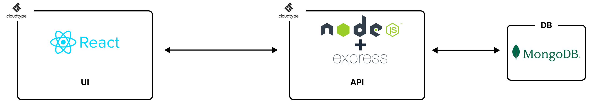

# 프로젝트 오늘

## 📚 목차
[1. 소개](#-소개)
[2. 기능](#-기능)
[3. 시스템 아키텍처](#-시스템-아키텍처)
[4. 프로젝트 기술 스택](#-프로젝트-기술-스택)
[5. 패키지 구조](#-패키지-구조)
[6. 개선 사항](#-개선-사항)


## 👋 소개

#### 현대의 우리는 바쁘고 여유 없이 살아갑니다.

#### 힘들고 고단한 하루를 보내는 우리에게 우리의 마음을 돌볼 시간이 필요합니다.

#### 웹 앱 '오늘'은 하루동안 들었던 생각, 마음을 돌아보고, 스스로에게 해주고픈 말을 들음으로서

#### 힘든 하루를 마무리한 사용자들에게 마음의 쉼을 얻을 수 있는 기회를 제공합니다.

#### 하루의 마음을 돌아보고 생각해 볼 수 있는 질문들을 한 문장씩 제공하고, 사용자의 답변을 날짜별로 기록합니다.

#### 또한, 다른 사용자들과 소통함으로써 서로에게 서로의 하루를 나누고, 공감하고, 위로받는 경험을 제공합니다.

배포 사이트: [여기를 클릭하여 페이지를 방문해주세요](https://web-oneul-client-mgurfw3q791cc2d7.sel3.cloudtype.app)

[맨 위로](#-목차)

---

## 🔧 기능

### '오늘'은 다음과 같은 서비스들을 제공합니다.

-   로그인
-   회원가입
-   메인
-   검색
-   나의 마음 돌아보기 (사용자의 하루를 정리, 감정을 표현)
-   캘린더 (사용자가 작성한 나의 마음보기를 날짜에 기반하여 정리)
-   우리의 오늘 (다른 사용자와 글을 공유)
-   마이페이지

---

## 🧩 시스템 아키텍처



[맨 위로](#-목차)

---

## 🛠 프로젝트 기술 스택
### 🌐 Client
#### 언어


#### 라이브러리 / 상태관리


#### 스타일링 / UI


[맨 위로](#-목차)

---

### ⚙ Server
#### 언어 / 런타임


#### 프레임워크


#### 데이터베이스


#### 인증 / 보안


#### 유틸리티


[맨 위로](#-목차)

---

## 📁 패키지 구조
### client
```bash
client
├─ src
│  ├─ api          : API URL 변수 보관
│  ├─ components   : 공용 컴포넌트
│  ├─ global       : global.css 및 theme 설정
│  ├─ hooks        : 커스텀 hook 함수
│  ├─ modules      : 모듈 함수 (login, signup 등)
│  ├─ pages        : 서비스별 페이지 및 layout, error 등
│  ├─ routes       : React Router 객체
│  └─ App.js       : client 진입점
```

### server
```bash
server
├─ auth            : JWT 전략 및 인증 로직
├─ connect         : MongoDB 연결
├─ controller      : 서버 컨트롤러
│  ├─ myMind
│  ├─ ourTodayPost
│  └─ ...
├─ images          : 사용자 프로필 이미지 보관
├─ models          : DB 스키마
├─ routes          : API 라우터
├─ utils           : 유틸 함수
└─ app.js          : 서버 진입점 
```

[맨 위로](#-목차)

---

## 🚀 개선 사항
- **2025.10.19** (by 이영섭)
1. API 경로 변수로 치환
2. package.json에 server 진입점 추가

- **2025.10.20** (by 이영섭)
1. bestPost 관련 로직 수정 => best 글 하나만 가져오도록 controller 및 MainPage(client) 로직 수정